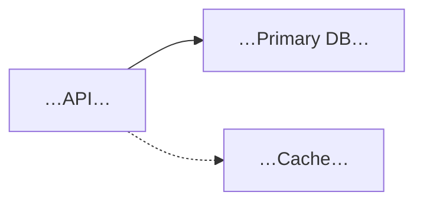

# Diagram Layout Rule — System Architect Protocol

This is the opinionated layout contract for every diagram in the blog.
Treat it like a code style guide: breaking a rule is a review comment, not
a taste difference. Written from the perspective of an engineer who ships
system-design diagrams for a living.

The 12 rules below cover **what goes where**, **why it goes there**, and
**what the reader should take away in 3 seconds**. The last point is the
real test — if a diagram needs a paragraph to explain, it has failed.

---

## R1 · One axis per diagram

- **Request flow → `flowchart LR`** (client left, data right)
- **Hierarchy / dependency → `flowchart TB`** (parent top, children bottom)
- **State machine → `stateDiagram-v2`**
- **Time ordering → `sequenceDiagram`**

Never mix axes inside one diagram. If you need both, split into two.

## R2 · Four tiers, at most

Every architecture diagram maps to ≤ 4 horizontal tiers:

| # | Tier          | Examples                                  |
|---|---------------|-------------------------------------------|
| 1 | **Entry**     | Client apps, CDN, DNS                     |
| 2 | **Edge**      | Load Balancer, API Gateway, WAF           |
| 3 | **Compute**   | API servers, workers, jobs                |
| 4 | **Data**      | Cache, DB, Object store, Search index     |

Observability / Analytics is a **separate bottom cluster**, not a tier.
Infra (service discovery, config, secrets) is annotation only — not inline.

## R3 · Collapse replicas

**Do not** draw 3 API Server boxes stacked vertically just because there
are 3 replicas in prod. Draw **one** node labeled `API Server × N` (or
`3× stateless`). Reader's takeaway is "stateless horizontal scaling" —
that idea fits in one box.

Exception: draw N boxes only when you are **illustrating distribution**
(e.g., consistent hashing, load-balancer placement, leader election).

## R4 · Max 7 nodes per cluster, 12 per diagram

If you need more, you are explaining too many things at once. Split into
two diagrams connected by a reference arrow. Reader attention caps at
~12 units before the eye gives up.

## R5 · Icons — one per node, logo for vendor, generic for role

- Vendor-specific (Postgres, Redis, S3, Kafka) → `logos:<name>` (branded)
- Generic role (server, cache, queue, cdn) → `mdi:<name>` (monochrome)
- Size: **24 px** in BBG mode
- Layout: **icon TOP, title + subtitle centered below** — matches the BBG
  URL Shortener reference style. Each line is independent, so node width
  equals the widest line, giving a uniform grid.

Why not icon-LEFT:
- `icon + gap + title` on one line forces that run to be the widest
  measurable element. When subtitle is longer than title, subtitle
  dictates box width and the title+icon float unevenly in the top half
  of the box. Editorial grid breaks.
- Icon-TOP keeps every line independent. Box width = `max(icon_w,
  title_w, subtitle_w) + padding` — typically title_w since icon is 24 px
  and subtitles are capped at 15 chars by R6.1.

Syntax: `{iconify:logos:postgresql}` — the toolkit's build-time inliner
extracts it to `/icons/<pack>-<name>.svg` and references by file URL.

### R5.1 · Why the fix lives in the plugin, not the stylesheet

Mermaid measures `htmlLabels` on a **scratch DOM node** appended directly
to `document.body`. That node is NOT inside `.diagram-figure[data-look]`
or the final `<svg>`, so any CSS gated behind those ancestors applies
**only post-commit** — after the foreignObject's width/height are
already frozen from the wrong measurement. Result: content reflows but
the box stays the measured size. That is the "text lệch box" failure
mode.

Three-layer defense, in the order they fire:

| Layer | Mechanism | Where | Fires during |
|---|---|---|---|
| **L1** load-bearing HTML | `` emitted by `remarkInlineIcons` | inline attributes on the img | scratch measurement AND post-commit (always) |
| **L2** author policy R6.1 | subtitle ≤ 15 chars | source | prevents wide labels at the source |
| **L3** Mermaid config | `flowchart.padding`, `nodeSpacing`, `rankSpacing` | `astro.config.mjs` | scratch measurement |

**What does NOT work as L2**: `max-width` / `padding` / `word-break` on
`.node foreignObject > div` scoped to `figure[data-look="bbg"] svg ...`.
Those selectors require ancestors the scratch node doesn't have, so
Mermaid can't see the constraint while measuring. You get narrower text
inside a measured-wider box — the exact visible overflow you were trying
to prevent.

If you ever feel the urge to add post-commit sizing CSS to fix overflow:
**fix the plugin output instead.** Anything that affects layout size
must ride on the element itself (attributes or inline `style`), never on
a stylesheet rule gated by ancestors that only exist at final render.

## R6 · Label = Role (bold) + Product (italic)

Two lines. The title is **what it IS** (role); the subtitle is **which
product fulfils it** (example).

```
<b>Primary Database</b>
<span class="sub">ex. Aurora MySQL</span>
```

✅ Reader learns: "this is a relational DB, implemented with Aurora"
❌ `Aurora MySQL` alone — reader has to reverse-engineer the role

## R6.1 · Subtitle budget: ≤ 15 characters

A 2-line node label must be read in ≤ 1 second. The node box auto-sizes to
its content — a long subtitle makes the box wider than its neighbors and
breaks the editorial grid (BBG look visible in reference). Cap subtitle at
**15 characters including the `ex. ` prefix**.

| OK | Too long → shorten |
|---|---|
| `ex. Aurora MySQL` (15) | `ex. Aurora Read Replica` (23) → `ex. Aurora R/O` |
| `ex. Route 53` (11) | `ex. CloudWatch Logs + Metrics` (29) → `ex. CloudWatch` |
| `stateless` (9) | `stateless · auto-scaled` (22) → `stateless` |

If 15 chars cannot convey the nuance, put it in the caption or surrounding
prose — **not inside the node**. The node is for identity, not for story.

## R7 · Edge discipline

| Edge style           | Meaning                                                |
|----------------------|--------------------------------------------------------|
| `-->` solid + arrow  | Synchronous call — user-facing                         |
| `-.->` dashed        | Async / optional / cache-miss / telemetry              |
| `==>` thick          | Hot path — the 99th-percentile path under load         |
| `<-->` bi-directional | Only for sync duplex (WebRTC, pub-sub). Rare.         |

**Every cross-tier edge must be labeled.** Unlabeled arrows inside one
cluster are OK (they mean "local".)

## R8 · No edge crossings (tolerance: 1)

Edge crossings are a failure of node ordering. Options, in order of
preference:

1. Reorder nodes within the same tier (Mermaid preserves order)
2. Collapse replicas (see R3)
3. Add an invisible alignment node (`:::hidden`) to force layout
4. Accept one crossing max, never two

## R9 · Exactly one focal node

Apply `classDef highlight` to the single node the post is *about*. Never
two. If you have two "main" things, split the diagram.

The highlight renders as purple-tinted fill with a thicker purple border
— the reader's eye locks on it immediately.

## R10 · Numbered flow when order matters

- `sequenceDiagram` → `autonumber` (built-in)
- `flowchart` → edge labels prefixed with ①②③ (Unicode circled digits)

Only number when **the order itself is the point**. Don't number arrows
that just connect boxes for structural reasons.

## R11 · Title + caption wrap every diagram

````
```mermaid {title="System Design: URL Shortener", caption="Read path with CDN, cache, and read-replica fan-out.", look="bbg"}
...
```
````

- **Title** — one line, describes the system (appears big above diagram)
- **Caption** — one sentence, explains the key takeaway (appears small below)

If a diagram needs neither, it's probably decorative — move it to an inline
span or drop it.

## R12 · Motion with semantic intent

BBG mode allows animation, but **every motion carries information**. Motion
is a signal, not decoration.

| Edge / node syntax      | Renders as              | Meaning                                          |
|-------------------------|-------------------------|--------------------------------------------------|
| `-->` solid             | blue bead flow (3 s)    | Synchronous request path                         |
| `-.->` dashed           | opacity shimmer (2.8 s) | Async / side-channel (telemetry, cache check)    |
| `==>` thick             | bigger + faster bead    | Hot path (p99 load traffic)                      |
| `:::highlight` on node  | breathing purple glow   | Focal node — subject the post is *about*         |

**Constraints:**

- Cap motion **≤ 2 active types per diagram**. Too many patterns = dashboard
  noise, not reference architecture.
- Default (non-BBG) mode keeps the global flow-dot behavior — every edge
  animates — for dynamic storytelling diagrams where motion is decorative
  but serves tempo.
- `prefers-reduced-motion: reduce` disables all animation in both modes —
  no exceptions.
- Never pair breathing focal with thick hot-path in the same diagram unless
  they are on the same node (hot path *to* the focal). They compete for
  the reader's eye.

## R13 · Components, not shapes

In BBG-style architecture diagrams, **role is a color, not a shape**.

Mermaid's `[(cylinder)]` and `([stadium])` shapes use fixed-ratio
ellipses / hemispheres that swell the bounding box beyond the editorial
grid. A 3-line icon-TOP label inside a cylinder ends up tall and
pinched; a 5-char label inside a stadium ends up as wide as a banner.
Either way, the grid breaks and the reader's eye stops on the odd
shape instead of the diagram.

**Rule:** every node is a rectangle `[...]`. Role signature comes from
a semantic token appended after the label — `:::database`, `:::cache`,
`:::queue`, etc. — which the toolkit's `remarkAutoClassDefs` binds to
a colored border at build time.

| Role | Token | Border color | Typical icon |
|---|---|---|---|
| Client / user-facing | `:::client` | slate | `mdi:cellphone`, `tabler:browser` |
| Edge / network | `:::edge` | blue | `logos:cloudflare`, `logos:aws-route53` |
| Compute | `:::compute` | purple | `mdi:server`, `logos:kubernetes` |
| Database | `:::database` | orange | `logos:postgresql`, `logos:mysql` |
| Cache | `:::cache` | emerald | `logos:redis` |
| Queue / stream | `:::queue` | violet | `logos:apache-kafka` |
| Object store | `:::storage` | amber | `logos:aws-s3` |
| Search index | `:::search` | sky | `logos:elasticsearch` |
| Observability | `:::observability` | gray | `logos:grafana`, `mdi:chart-line` |
| External / 3rd-party | `:::external` | slate (dashed) | `mdi:api` |

Author writes only the token — no `classDef` boilerplate. The plugin
injects the matching classDef at build time, and only for classes the
fence actually references. A per-diagram `classDef database …` still
wins if the author needs a one-off override.



---

## Worked example

Bad (breaks R2, R3, R8):
```
Client → LB → api1, api2, api3 → db1, db2, db3 → logs, metrics, alerts
```
5 tiers (breaks R2), 3 API replicas drawn (R3), 9 edges crossing (R8).

Good:
```
Clients ──▶ DNS ──▶ CDN ──▶ LB ──▶ API × 3 ──▶ Primary DB
                                             ──▶ Read Replica
                                             ──▶ Object Store
                                  └──▶ Cache
                                  └──▶ Rate Limiter
                                  
           Analytics cluster (bottom): Logs → Metrics → Alerting → Dashboard
```
4 tiers, 1 API node, 0 crossings, one focal if needed.

## Quick review checklist (paste into PR)

```
[ ] R1  single axis (LR / TB / state / seq)
[ ] R2  ≤ 4 tiers + separate observability
[ ] R3  replicas collapsed unless illustrating distribution
[ ] R4  ≤ 7 per cluster, ≤ 12 total
[ ] R5  icon left + 20 px + logo for vendor / mdi for role
[ ] R6  Role bold + Product italic subtitle
[ ] R6.1 subtitle ≤ 15 chars (incl. `ex. ` prefix)
[ ] R7  solid=sync, dashed=async, thick=hot, every cross-tier labeled
[ ] R8  zero edge crossings (tolerance 1)
[ ] R9  one highlight focal
[ ] R10 numbered only when order is the point
[ ] R11 title + caption
[ ] R12 motion = semantic (bead/shimmer/thick/breathe), ≤ 2 types, reduced-motion disabled
[ ] R13 rectangles only (no `[(…)]` / `([…])` shapes), role via `:::component` tokens
```
